[linkedin](https://www.linkedin.com/in/faheem-ali-b87293373/)

> Mechanical Engineering Student &nbsp;·&nbsp; Web Developer &nbsp;·&nbsp; R&D Engineering Intern

I engineer software and hardware solutions that bridge digital applications with the physical world. My work ranges from full-stack web applications and electromechanical systems to functional engineering prototypes.

Alongside software development, I bring hands-on experience in CAD modeling, digital manufacturing, rapid prototyping, electronics assembly, and applied engineering research.

<samp>typescript</samp> &nbsp; <samp>javascript</samp> &nbsp; <samp>react</samp> &nbsp; <samp>next.js</samp> &nbsp; <samp>c++</samp> &nbsp; <samp>python</samp> &nbsp; <samp>css</samp> &nbsp; <samp>html</samp>

**[lab-ledger](https://github.com/Faheem2641/lab-ledger)** &nbsp;·&nbsp; <samp>typescript, next.js, css</samp> 
Lab budget tracking and expenditure management web application. 
Features real-time expense categorization, budget limits, and analytics dashboard.

**[Cinetrack](https://github.com/Faheem2641/Cinetrack)** &nbsp;·&nbsp; <samp>typescript, react</samp> 
Movie tracking platform and media discovery web application. 
Enables search, watchlist curation, and personalized rating tracking.

**[Irrigation-System](https://github.com/Faheem2641/Irrigation-System)** &nbsp;·&nbsp; <samp>c++</samp> 
Smart automated irrigation controller engineered for precision agriculture. 
Integrates real-time soil moisture sensors and automated valve actuators.

**[Radar-System](https://github.com/Faheem2641/Radar-System)** &nbsp;·&nbsp; <samp>c++</samp> 
Ultrasonic radar detection and spatial mapping system. 
Provides distance measurement, motor rotation scanning, and live spatial visualization.

